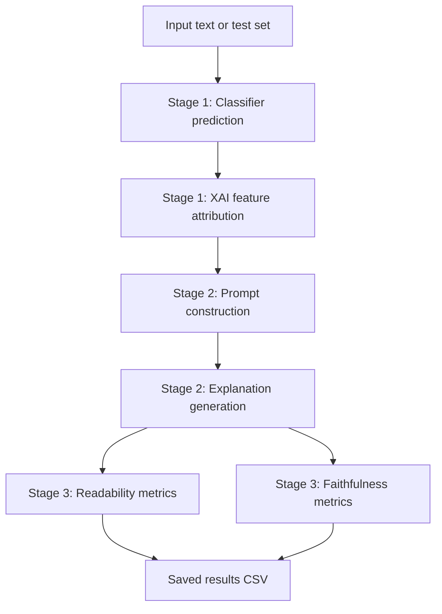

# MCC Directory Report

## Scope

This report documents the contents of the `MCC` directory only. The `scripts/` subfolder is intentionally excluded, as requested.

The directory implements a full user-adaptive explanation pipeline for multi-class text classification. The core idea is:

1. classify an input text,
2. identify the most influential tokens with an XAI method,
3. generate a natural-language explanation tailored to the intended reader,
4. evaluate the explanation with readability and faithfulness metrics,
5. save the results for later comparison.

The code is organized around a small set of reusable Python modules and two notebooks. The modules handle loading models, constructing prompts, generating explanations, and constrained decoding. The notebooks orchestrate the end-to-end experiments and result analysis.

---

## High-Level Workflow

The pipeline runs in four conceptual stages:

The notebook `experiment.ipynb` is the main driver. It loads the classifier and LLM, processes one or more input texts, optionally applies constrained decoding, and saves the final table to a CSV file in `results/`.

The notebook `result_comparision.ipynb` is a small analysis notebook that compares saved runs, mainly by loading CSV outputs and summarising metric differences between audience settings or experimental conditions.

---

## Directory Contents

The key files in `MCC/` are:

| File | Purpose |
|---|---|
| `config.py` | Central configuration for model paths, hyperparameters, audience settings, prompt defaults, and experiment inputs. |
| `constrained_decoding.py` | Readability-constrained beam decoding implementation used during explanation generation. |
| `experiment.ipynb` | Main end-to-end experiment notebook. |
| `model_loaders.py` | Functions that load the classifier and the LLM. |
| `pipeline_helpers.py` | Shared helper functions for XAI, prediction, prompt building, generation, metrics, and checkpoint I/O. |
| `prompts.json` | Prompt templates and class descriptions used by the explanation generator. |
| `result_comparision.ipynb` | Lightweight notebook for comparing saved experiment outputs. |
| `test_data.txt` | Default text file used when no inline inputs are supplied in `config.py`. |
| `word_lists.json` | Vocabulary lists and readability lexicons used by constrained decoding. |
| `results/` | Output directory containing saved experiment CSVs. |

There is also a `constrained_decoding_report.md` file, which is a focused technical report on the constrained decoding subsystem itself.

---

## File-by-File Report

### `config.py`

This file is the configuration hub for the entire pipeline. The top comment explicitly says it should be the place where paths and hyperparameters are edited, rather than changing code in multiple files.

It serves four major roles:

1. **Loads word lists** from `word_lists.json`.
2. **Defines model paths** for the classifier and the LLM.
3. **Sets experiment hyperparameters** for XAI, generation, constrained decoding, and readability penalties.
4. **Stores the experiment inputs** and audience label used by `experiment.ipynb`.

Important configuration groups include:

- `CLASSIFIER_MODEL_PATH` and `LLM_MODEL_NAME`, which tell the loaders where to find the fine-tuned classifier and the instruction-tuned generation model.
- `LABEL_TO_CLASS`, which maps the classifier’s internal labels to human-readable class names.
- `XAI_METHOD`, `XAI_NUM_FEATURES`, and `XAI_NUM_SAMPLES`, which control whether the pipeline uses LIME or Integrated Gradients and how many features are retained.
- `USE_CONSTRAINED_DECODING`, `NUM_BEAMS`, `MIN_NEW_TOKENS`, and `LAMBDA_MAP`, which shape the constrained generation behavior.
- `INPUT_TEXTS`, `USER_CATEGORY`, and `EXPERIMENT_TAG`, which define the active run.

The configuration is also where the readability machinery gets its domain vocabulary:

- `COMMON_WORDS`
- `BIOMEDICAL_WHITELIST`
- `CLAUSE_MARKERS`
- `DALE_CHALL_FAMILIAR`

These are used downstream in constrained decoding to estimate word difficulty and syntactic complexity.

The file is effectively the control panel for the whole experiment. If someone wants to test a different dataset, a different user profile, or a different XAI method, this is the first file they should edit.

### `word_lists.json`

This JSON file contains the vocabulary resources that support readability-aware decoding.

It stores:

- `common_words`: general high-frequency function words and everyday vocabulary.
- `biomedical_whitelist`: biomedical terms that should not be treated as rare just because they are domain-specific.
- `clause_markers`: words that often introduce subordinate clauses or syntactic complexity.
- `dale_chall_extra`: a large set of additional familiar words.

The file is used indirectly through `config.py`, which loads the lists and merges them into the sets required by the decoder. This design keeps lexical resources separate from code, which makes the project easier to tune without changing implementation logic.

### `prompts.json`

This file stores the prompt content used in Stage 2.

It has two main parts:

1. `system_prompt`
2. `class_descriptions`

The `system_prompt` defines the explanation task, the safety boundaries, and the style rules for BEGINNER, INTERMEDIATE, and EXPERT audiences. It tells the model to ground the explanation only in the input, prediction, and XAI features, and to write a short paragraph rather than bullet points.

The `class_descriptions` dictionary gives a short semantic description for each class label, such as:

- Neoplasms
- Digestive system diseases
- Nervous system diseases
- Cardiovascular diseases
- General pathological conditions

These descriptions are injected into the final prompt so the generator has a compact, human-readable explanation of what the predicted label means.

### `model_loaders.py`

This module provides the model-loading layer for the whole pipeline.

It contains two functions:

#### `load_classifier()`

This function loads the fine-tuned sequence classifier from `CLASSIFIER_MODEL_PATH`, creates a Hugging Face text-classification pipeline, and returns both the raw model and the pipeline.

The pipeline is configured with:

- truncation enabled,
- `top_k=None`,
- automatic device selection using CUDA if available.

This loader is used in the notebook before any inference begins. By returning both the model and the pipeline, it supports both prediction and XAI methods that need access to the classifier internals.

#### `load_llm()`

This function loads the instruction-tuned LLM from `LLM_MODEL_NAME` and returns the tokenizer plus the model.

The model is loaded with:

- `torch_dtype=torch.float16`,
- `device_map="auto"`,
- `trust_remote_code=True`.

This setup is suitable for local generation with a relatively small instruction model. The notebook uses this loader once and reuses the model for all inputs.

### `pipeline_helpers.py`

This is the central utility module in the repository. It holds the logic that glues the pipeline stages together.

It is organised into seven sections:

1. XAI feature attribution
2. Classifier prediction
3. Prompt building
4. Explanation generation
5. Readability metrics
6. Faithfulness metrics
7. Checkpoint I/O

#### Stage 1: XAI attribution

The module supports two XAI methods:

- `run_lime()`
- `run_ig()`

`run_lime()` wraps `LimeTextExplainer` and uses a custom predictor function so that the pipeline gets class probabilities in the correct label order.

`run_ig()` implements Integrated Gradients using Captum. It tokenizes the text, finds the predicted class, computes gradients with respect to token embeddings, and then aggregates subword pieces back into whole-word scores.

The dispatcher `run_xai()` chooses between the two methods based on the value of `XAI_METHOD` in `config.py`.

#### Stage 1: Prediction

`predict_class()` runs the classifier on the text, extracts the top prediction, converts the internal class label into the human-readable class name using `LABEL_TO_CLASS`, and returns both the class and confidence.

#### Stage 2: Prompt construction

`build_prompt()` assembles the full generation prompt. It combines:

- the original input text,
- the predicted class,
- the class meaning from `prompts.json`,
- the top XAI tokens,
- the audience-specific instruction,
- the task description.

The prompt is deliberately verbose and explicit. It tells the model not to simply restate the abstract, but to explain why the visible tokens matter for the predicted label.

The audience instruction is now phrased in general terms:

- BEGINNER = layman / non-specialist
- INTERMEDIATE = normal intermediate reader
- EXPERT = domain expert

This means the prompt can be reused across datasets and tasks without sounding biomedical-only in the audience framing.

#### Stage 2: Explanation generation

`generate_explanation()` takes the prompt and sends it to either:

- the constrained beam generator, if `USE_CONSTRAINED_DECODING` is enabled, or
- the standard `model.generate()` sampling path otherwise.

The function preserves a fallback for empty XAI features, returning a short message instead of trying to generate an explanation with no attribution context.

#### Stage 3: Readability metrics

`readability_metrics()` computes:

- Flesch Reading Ease,
- Flesch-Kincaid Grade,
- SMOG Index.

These are used to quantify how easy or difficult the generated explanation is to read.

#### Stage 3: Faithfulness metrics

`xai_coverage()` measures how many XAI feature words appear in the explanation text. This is a simple faithfulness proxy. A back-compat alias `lime_coverage` is also kept for older notebook code.

#### Checkpoint I/O

`save_checkpoint()`, `load_checkpoint()`, and `checkpoint_exists()` provide small JSON-based utilities for persistence. They are general-purpose helpers for saving intermediate run data or resuming work.

### `constrained_decoding.py`

This module implements the readability-constrained generator used in Stage 2.

Its main purpose is to bias generation toward simpler, shorter, and more readable explanations without retraining the language model.

The key components are:

#### `PrefixStats`

This dataclass stores live prefix statistics such as:

- word count,
- clause count,
- syllable count,
- polysyllabic count,
- sentence count,
- character count.

These statistics let the decoder reason about the current partially generated explanation.

#### `ReadabilityLogitsProcessor`

This is the heart of the constrained decoding system.

At initialization, it precomputes token-level feature tensors for the whole tokenizer vocabulary. These include whether a token is unfamiliar under Dale-Chall-style familiarity, whether it is a clause marker, its syllable complexity, and its character length.

On each generation step, it:

1. aligns the precomputed tensors with the actual vocabulary size,
2. computes token penalties,
3. applies a length penalty based on the generated prefix,
4. gives the EOS token a relative bonus as the explanation grows longer.

This makes the decoder a dynamic readability filter rather than a fixed template.

#### `ReadabilityBeamGenerator`

This wrapper integrates the logits processor with Hugging Face beam search.

It resolves the audience-specific `lambda` value from `LAMBDA_MAP`, applies the chat template, constructs the inputs, and calls `model.generate()` with the constrained logits processor attached.

If the user category is `EXPERT`, the lambda value is zero, so the readability penalty is effectively disabled.

### `experiment.ipynb`

This is the main operational notebook.

Its structure mirrors the pipeline stages and acts as the orchestration layer for the whole experiment.

The notebook contains the following steps:

#### 0. Path bootstrap

The notebook adds the current directory to `sys.path` so that local modules such as `config`, `model_loaders`, and `pipeline_helpers` can be imported cleanly.

#### 1. Imports

It imports:

- configuration values from `config.py`,
- the constrained decoder class,
- model loaders,
- helper functions for XAI, prediction, prompt generation, and metrics.

#### 2. Experiment configuration display

The notebook prints the active experiment settings, including:

- experiment tag,
- XAI method,
- user category,
- constrained decoding status,
- lambda value,
- number of beams,
- output path,
- number of inputs.

This is useful as a sanity check before running a batch.

#### 3. Input texts

The notebook either uses the inline `INPUT_TEXTS` list from `config.py` or falls back to loading all non-empty lines from `test_data.txt`.

This makes the pipeline flexible: it can run on a fixed curated list or on a larger text file with minimal changes.

#### 4. Model loading

The classifier and LLM are loaded once and reused for every input.

If constrained decoding is enabled, the notebook also constructs a `ReadabilityBeamGenerator`.

#### 5. Batch pipeline

This is the core loop. For each input text, the notebook:

1. predicts the class,
2. computes XAI features,
3. builds and runs the explanation generator,
4. computes readability and faithfulness metrics,
5. stores all outputs in a result dictionary.

The result dictionary includes the prediction, confidence, explanation, coverage, and readability scores. Each row is appended to `all_results`.

#### 6. Results summary

The notebook converts the list of dictionaries into a pandas DataFrame and shows a compact summary table. It also computes averages for key metrics such as FRE, FKGL, and XAI coverage.

#### 7. Saving results

The final DataFrame is written to the CSV path defined in `config.py`.

The notebook then prints each explanation in full, which is helpful for inspection or qualitative review.

### `result_comparision.ipynb`

This notebook is an analysis helper for comparing stored output CSVs.

From the current structure, it appears to:

- load CSV outputs with pandas,
- compare beginning vs. expert runs,
- compute average readability metrics,
- print side-by-side summaries.

It is much lighter than `experiment.ipynb` and serves as a quick comparison workspace rather than a full pipeline driver.

### `test_data.txt`

This text file acts as a default input source when `INPUT_TEXTS` in `config.py` is `None`.

The notebook reads one non-empty line per example. This is a simple and practical way to switch between a small hand-edited experiment set and a larger batch text file.

### `results/`

This folder stores the final outputs of experiments.

The naming convention is derived from `EXPERIMENT_TAG`, which is usually a combination of user category and XAI method. A run can therefore be traced back from the filename alone.

The visible file `expert_lime.csv` is a sample saved result table. The CSV contains columns such as:

- `input_index`
- `experiment_tag`
- `xai_method`
- `user_category`
- `constrained_decoding`
- `lambda`
- `predicted_class`
- `confidence`
- `text_snippet`
- `xai_features`
- `explanation`
- `xai_coverage`
- `flesch_reading_ease`
- `flesch_kincaid_grade`
- `smog_index`

This schema makes the output suitable for both quantitative comparison and qualitative inspection.

### `constrained_decoding_report.md`

This is a companion documentation file dedicated to the readability-constrained decoding subsystem.

It explains:

- why constrained decoding is used,
- how the `LogitsProcessor` works,
- how hardness features are defined,
- how the lambda values map to audience tiers,
- how the system interacts with the prompt,
- how readability metrics align with the generation constraints.

It is a technical deep dive into the generation-control layer of the project.

---

## How the Pieces Fit Together

The runtime flow is straightforward:

1. `config.py` defines the active experiment.
2. `experiment.ipynb` reads the configuration and loads the models.
3. `pipeline_helpers.py` predicts the class and extracts XAI features.
4. `pipeline_helpers.py` builds a task-aware and audience-aware prompt.
5. `constrained_decoding.py` optionally enforces readability during generation.
6. `pipeline_helpers.py` computes readability and coverage metrics.
7. The notebook saves the result table into `results/`.
8. `result_comparision.ipynb` compares saved CSV outputs.

The design is modular: all reusable logic lives in Python modules, while the notebooks remain orchestration and analysis surfaces.

---

## Design Characteristics

### Strengths

- Clear separation between configuration, generation logic, and notebook orchestration.
- Prompt templates are externalized into JSON rather than hardcoded in the notebook.
- The same pipeline can run with LIME or Integrated Gradients by changing one config value.
- The same generation model can support different audience levels through soft prompting and constrained decoding.
- Output CSVs preserve all the key metadata needed for later comparison.

### Practical Tradeoffs

- The pipeline is strongly driven by configuration, so incorrect values in `config.py` can affect the whole experiment.
- The constrained decoding path is more complex than standard sampling, but it provides much better control over readability.
- The saved XAI features are serialized as strings in the CSV, which is convenient for inspection but less convenient for downstream programmatic parsing.

---

## Summary

The `MCC` directory is a self-contained explanation-generation experiment stack. It loads a classifier, extracts salient tokens, constructs a task-aware and audience-aware prompt, generates a natural-language explanation, and evaluates that explanation with readability and faithfulness metrics. The code is intentionally modular, with `config.py` as the control center, `pipeline_helpers.py` as the shared logic layer, `constrained_decoding.py` as the generation-control mechanism, and `experiment.ipynb` as the main execution notebook.

The `scripts/` folder was not included in this report.
